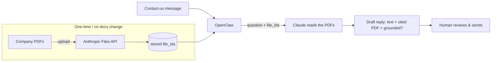

# Contact-Us Auto-Reply — Design & Spec (v1, the current build)

> This is the **active spec** for what we are building now. It supersedes the heavier
> Phase-1 pipeline (intent classification, keyword/vector retrieval, capability gating,
> approval workflow). `openclaw-plan.md` remains the long-term vision to grow into.

## 1. Use case (one sentence)

A customer sends a **contact-us message**; OpenClaw **drafts a reply grounded in a small set
of company PDFs**, using Claude, and a **human reviews it before sending**.

## 2. Key decisions (and why)

- **Knowledge base = a handful of PDFs (≈1–20), read directly by Claude.** No vector database,
  no embeddings, no chunking, no RAG service. That machinery only earns its keep with too many
  docs to read at once — not our case.
- **PDFs are uploaded once to the Anthropic Files API → reused by `file_id`.** This is the
  "upload somewhere, use as an API" model, with no second vendor and no extra cost beyond the
  Claude calls we already make.
- **Propose, don't send.** v1 produces a *draft* for a human to review and send. Auto-sending is
  explicitly out of scope.
- **One provider: Claude.** Drafting and PDF reading are both Claude calls.

## 3. Architecture



There is no vector DB, no retrieval index, no Django, no message queue. Just: upload PDFs once →
for each message, Claude reads them and drafts a grounded reply.

## 4. Components & interfaces

| Piece | Responsibility | Signature (intended) |
|---|---|---|
| **PDF upload** | Upload PDFs to the Files API; return + persist `file_id`s. Run once, or when docs change. | `upload_pdfs(paths: list[str]) -> list[str]` |
| **Draft** | Send the customer message + `file_id`s to Claude; return the grounded draft. | `draft_reply(message: str, file_ids: list[str], llm) -> Reply` |
| **ClaudeLLM** | Wrap `messages.create` with PDF `document` blocks (by `file_id`) and citations enabled. | `complete(...)` |

```
Reply = { text: str, citations: list[str], grounded: bool }
```
`grounded == False` ⇒ the PDFs don't cover the question ⇒ escalate to a human, don't invent an answer.

## 5. Knowledge base

- **Source:** a handful of company PDFs (FAQ, policies, help docs).
- **Pluggable backend (agnostic):** the pipeline depends only on a `KnowledgeBackend` protocol
  (`draft_reply(message) -> Reply`). The **default** backend (`FilesApiBackend`) has Claude read
  PDFs uploaded to the Anthropic Files API — upload returns a `file_id`, files persist and are
  reused, ids kept in a small local list. To switch to a RAG service/vector DB later, implement
  the same protocol and swap it in at the composition root (`mcp_server.py`) — nothing else changes.
- **Grounding rule:** answer **only** from the knowledge; cite the source; if the answer isn't
  there, say so (→ `grounded: false` → escalate).

## 6. Claude Files API — implementation notes

- Beta header `files-api-2025-04-14` on **both** the upload and the `messages.create` that
  references the file.
- Upload: `client.beta.files.upload(file=(name, open(path,"rb"), "application/pdf"))` → `.id`.
- Reference in a message: a `document` content block with
  `source = {"type": "file", "file_id": "<id>"}`, plus `citations: {"enabled": true}` to get
  cited spans back.
- Model: `claude-opus-4-8` (default). Limits: 32 MB / 100 pages per PDF for 200k-context paths;
  a handful of normal PDFs is well within bounds.

## 7. Out of scope for v1 (deliberately)

- Auto-sending replies (human reviews and sends).
- Email intake/outbound wiring, Reddit, or any channel beyond a message string in.
- Vector search / RAG / scaling to many documents.
- Approval-workflow system, capability gating, audit log, Django backend, multi-user/RBAC.

These live in `openclaw-plan.md` as the longer-term platform and can be added when a real need
appears — not before.

## 8. Prerequisites

1. `ANTHROPIC_API_KEY` (or `ant auth login`) — both upload and drafting are Claude calls.
2. The company PDFs.

## 9. Success criteria

- Upload N PDFs → get N `file_id`s back; re-running with the same docs reuses them.
- For a message answerable from the PDFs: draft is accurate, grounded, and cites the right PDF.
- For a message **not** covered by the PDFs: `grounded == False` and no answer is fabricated.
