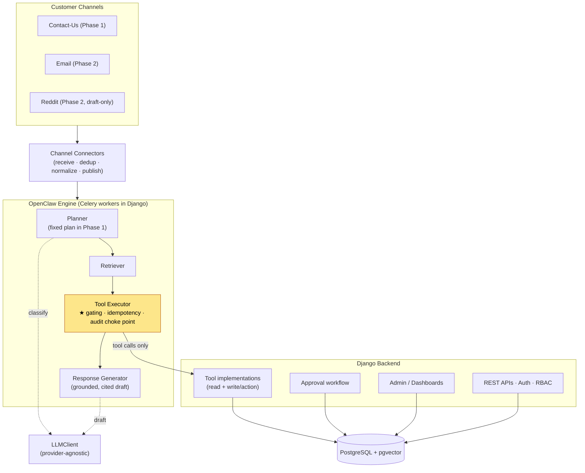
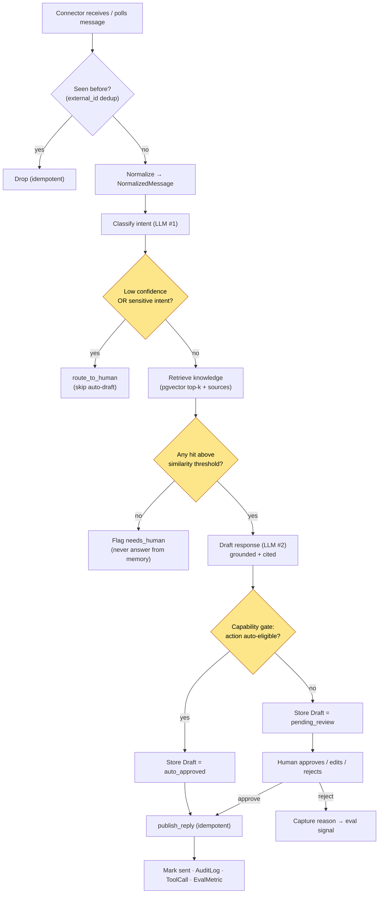
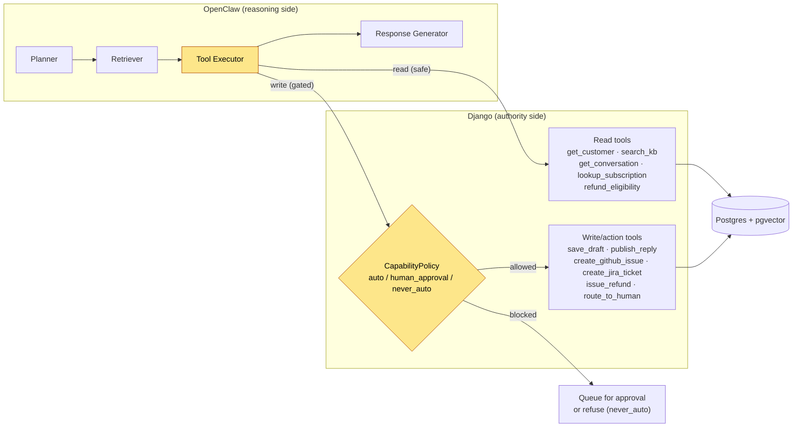
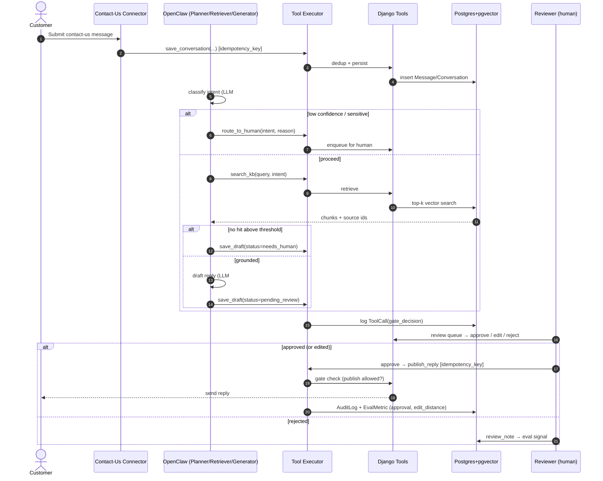
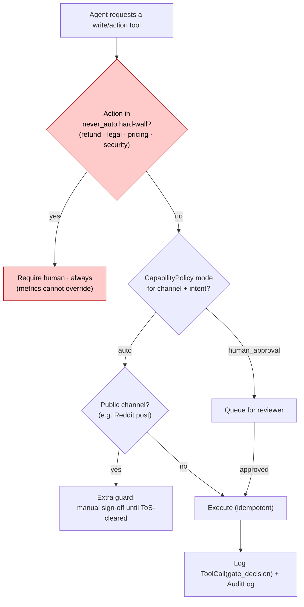

# OpenClaw — Architecture & Sequence Diagrams

Visual companion to `openclaw-plan.md`. Diagrams are Mermaid (render in GitHub / most viewers).

---

## 1. System architecture (components)

Where OpenClaw stops and Django begins — the tool interface is the only boundary.



> The agent knows **only tool schemas**. Every side effect crosses into Django through the Tool
> Executor → tool implementations. Swap the agent or the DB and the other side is unaffected.

---

## 2. Pipeline flow (per inbound message)



---

## 3. Agent runtime ↔ tool boundary



> Security consequence: because every action flows through gated Django-side tools, prompt
> injection can at worst yield a **draft** or a **safe read** — never an unauthorized action.

---

## 4. Sequence — propose-then-approve loop (Contact-Us, Phase 1)



---

## 5. Capability gating — decision per action



> Promotion `human_approval → auto` happens only when measured approval rate + edit distance
> meet the criteria for that channel + intent (see `openclaw-plan.md` §6, §9).
```
